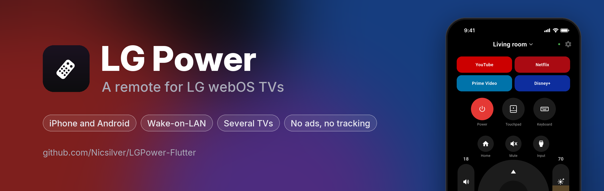
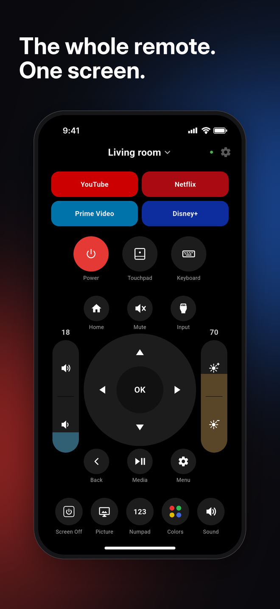
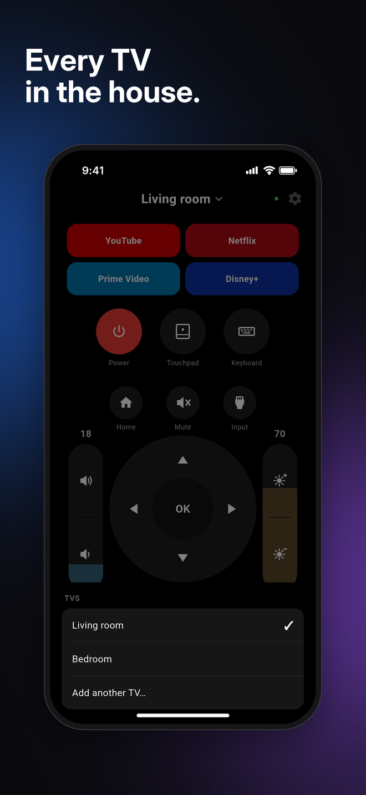
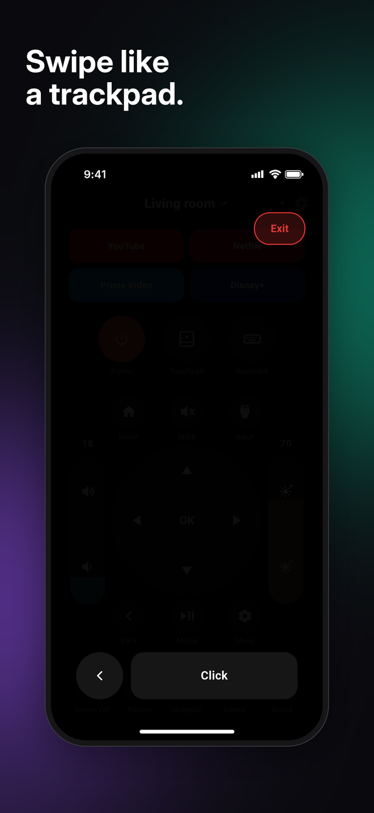
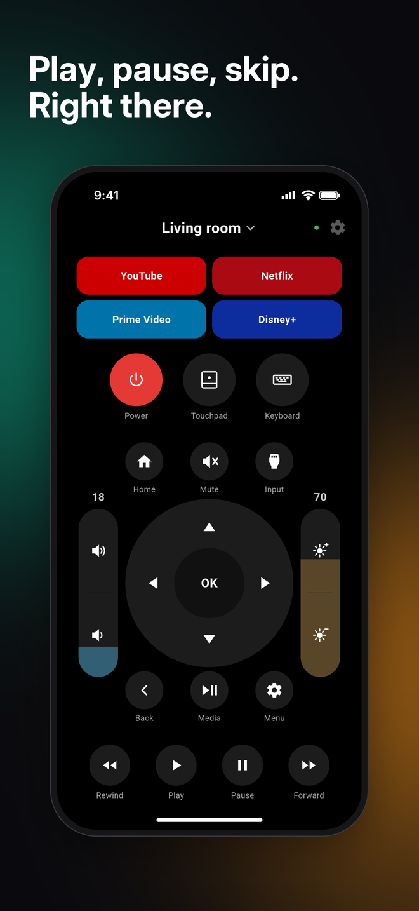
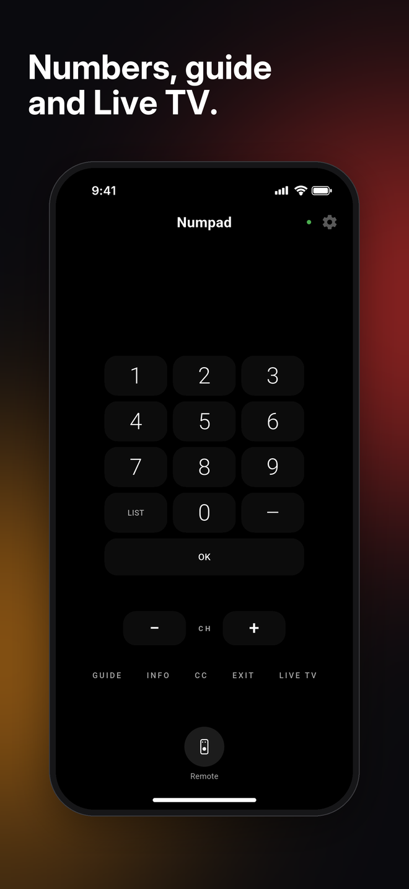
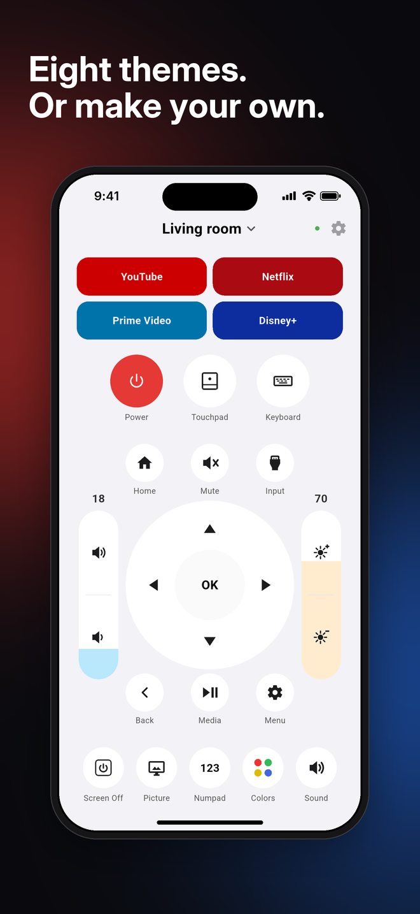
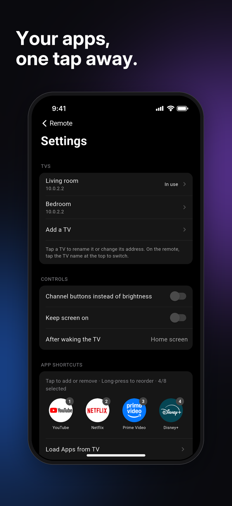
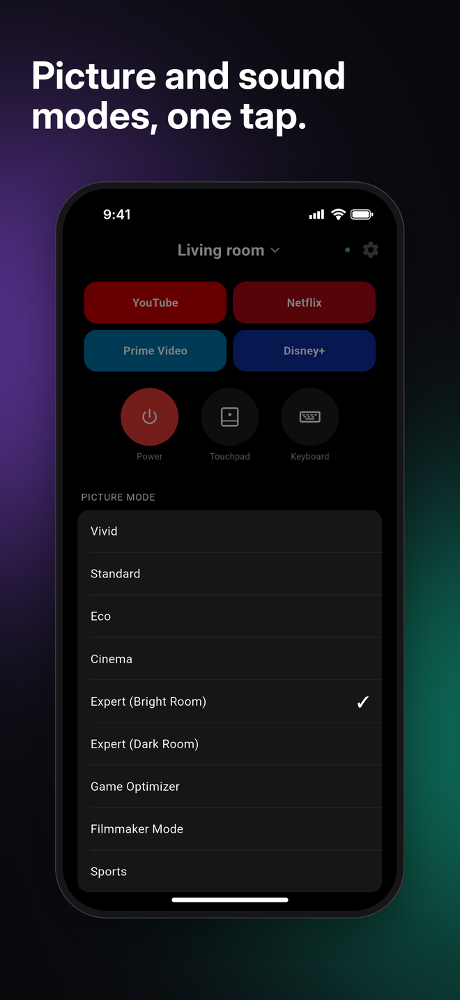
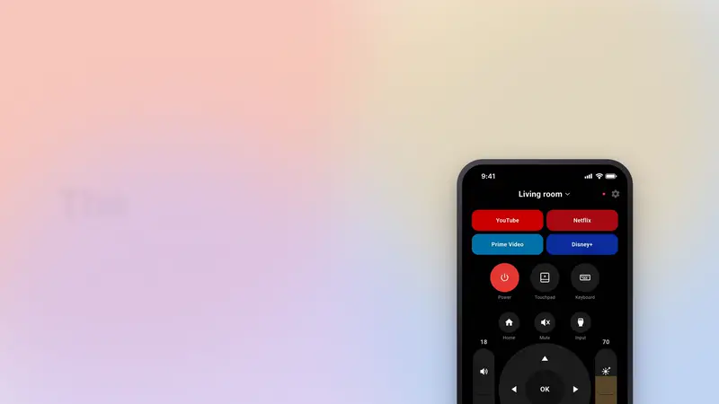

# LG Power (Flutter)

Cross-platform port of [LG Power](https://github.com/Nicsilver/LGPower), a remote for LG webOS TVs.
Same features as the Android app (Wi-Fi control over the webOS protocol, Wake-on-LAN power on,
touchpad, keyboard, app shortcuts, themes, IR service remote on Android phones with a blaster),
built with Flutter so it also runs on iPhone.

Free, no ads, nothing tracked. Talks only to the TV on your own network.

  
  
  
  

  
  
  
  

   
  <a href="https://www.youtube.com/watch?v=PsDJb3oJZoY">Watch the 30 second promo with sound</a>

